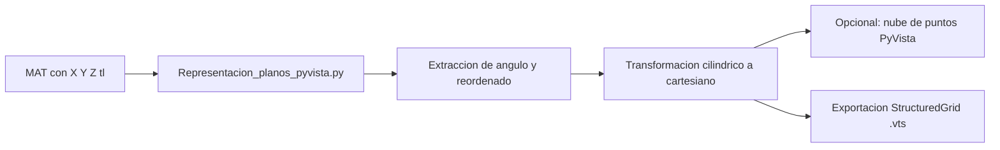

# Manipulacion_de_Planos: de MAT a malla 3D para ParaView

Este modulo convierte una coleccion de planos TL en formato `.mat` a una representacion 3D rotada por angulo y, opcionalmente, exporta una malla estructurada `.vts` para visualizacion en ParaView.

Script principal:
- `Representacion_planos_pyvista.py`

Wrapper opcional para SLURM:
- `gen_vts.sh`

## Que hace el script

1. Lee archivos `.mat` (HDF5) desde una carpeta de entrada.
2. Extrae el angulo desde el nombre del archivo (primero busca `PlaneAngle...`, luego cualquier numero como fallback).
3. Carga `X`, `Y`, `Z` y `tl`.
4. Re-centra todos los planos a un origen comun usando el primer archivo.
5. Rota cada plano en torno al eje vertical usando el angulo asociado.
6. (Opcional) Renderiza nube de puntos en PyVista.
7. (Opcional, recomendado) Exporta volumen 3D completo a `.vts` como `StructuredGrid`.

## Requisitos

- Python 3.9+
- Paquetes:

```bash
pip install numpy h5py pyvista
```

## Configuracion importante

Edita solo las variables de configuracion al inicio de `Representacion_planos_pyvista.py`:

- `folder`: carpeta con los `.mat` a procesar.
- `N_PLANES`: `None` para usar todos, o entero para limitar los mas recientes.
- `SHOW_PYVISTA`: `True` para abrir ventana 3D, `False` para modo batch.
- `EXPORT_VTS`: `True` para exportar `.vts`.
- `VTS_OUTPUT_PATH`: ruta del archivo de salida.
- `PLANE_GRID_SHAPE`: dimensiones esperadas de cada plano `(nx, ny)`.
- `ENABLE_TL_THRESHOLD` y `TL_MIN`: filtro de intensidad opcional.

Nota critica:
- `PLANE_GRID_SHAPE` debe coincidir con el shape real de `X`, `Y`, `Z`, `tl` en los `.mat`.
- Si no coincide, el script falla para evitar exportaciones inconsistentes.
- Si detecta shape transpuesto `(ny, nx)`, lo corrige automaticamente.

## Ejecucion

Ejecucion directa:

```bash
cd Manipulacion_de_Planos
python Representacion_planos_pyvista.py
```

## Entradas esperadas

Cada `.mat` debe incluir datasets:
- `X`
- `Y`
- `Z`
- `tl`

Ejemplos de nombres validos:
- `...PlaneAngle-104.47.mat`
- `val_generado_+31.46.mat`

## Salidas

- Visualizacion local en PyVista (si `SHOW_PYVISTA=True`).
- Archivo `.vts` (si `EXPORT_VTS=True`), por defecto:
  - `<folder>/planos_rotados.vts`

El `.vts` contiene:
- `points` 3D de todos los planos apilados
- escalar `tl` por punto
- dimensiones de malla `(nx, ny, nz)` con `nz = numero_de_planos`

## Flujo resumido



## Troubleshooting rapido

- Error de shape:
  - Revisa `PLANE_GRID_SHAPE` y confirma dimensiones reales de los `.mat`.
- No encuentra archivos:
  - Verifica `folder` y que contenga `.mat`.
- Rotacion incorrecta:
  - Asegura que los nombres incluyen `PlaneAngle...` o un numero interpretable.
  - El script decide grados/radianes automaticamente segun rango de valores.