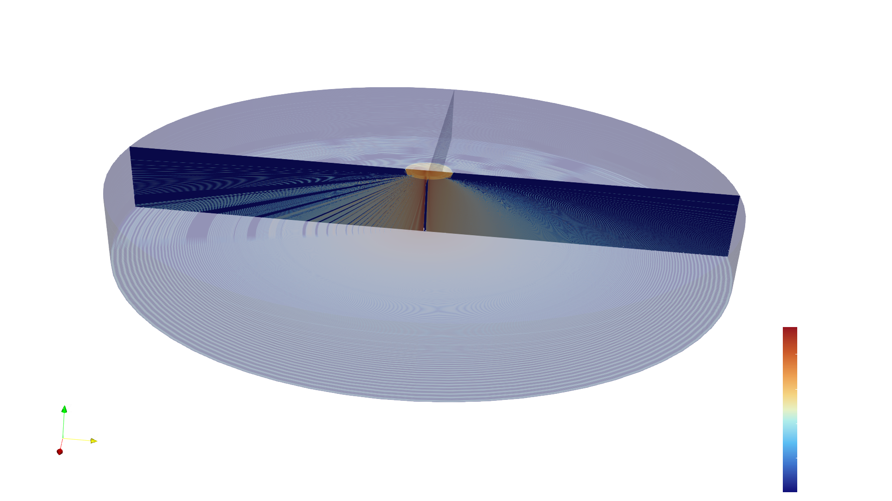
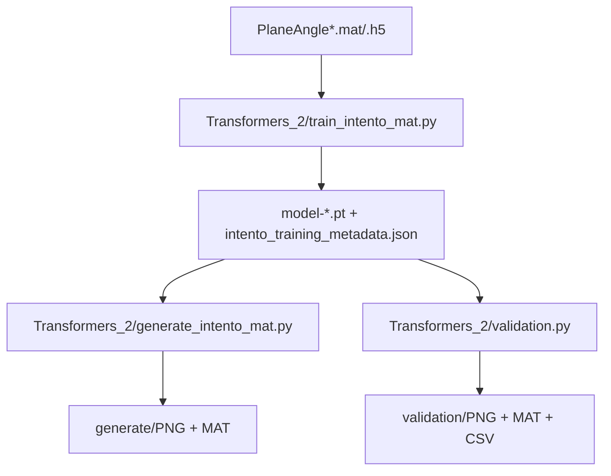
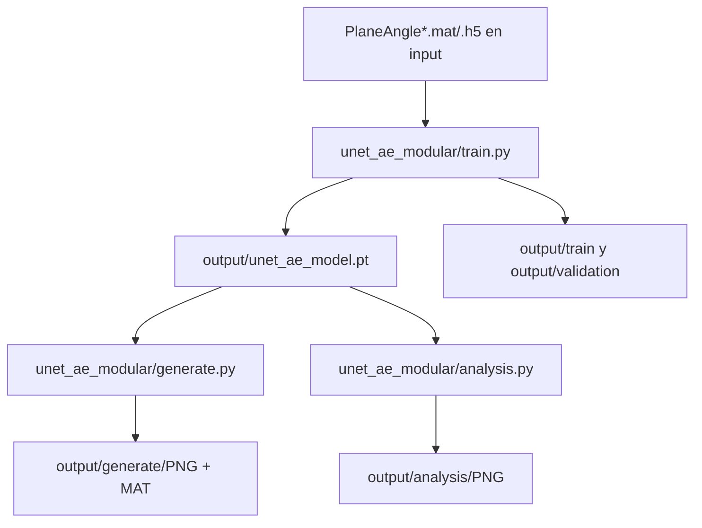

# TFG_repo: Generación condicionada de campos de Transmission Loss (TL)



Repositorio con **7 proyectos principales de modelado** para campos acústicos de *Transmission Loss* condicionados por ángulo, más una utilidad de post-proceso 3D.

## 📊 Comparativa de modelos

| Ruta | Tipo de modelo | Características | Recomendación |
|---|---|---|---|
| **unet_hibrido** ⭐ | UNet + MLP + PINN | Reconstrucción con UNet y física continua con un PINN MLP separado. | **Principal (recomendado)** |
| Transformers_2 | DiT + Diffusion iterativo | Máxima calidad. Generación estocástica. ~6h entrenamiento. | Máxima calidad, tiempo disponible |
| unet_ae_modular | UNet AE puro (determinista) | Rápido, compacto, sin física. ~30min entrenamiento. | Prototipado rápido |
| unet_ae_modular_inpainting | UNet AE + Inpainting | UNet con capacidad de completa datos faltantes. | Datos incompletos/huecos |
| unet_pinn | UNet AE + física en grilla | UNet dentro de un marco PINN, sin MLP físico separado. | Comparación/debugging |
| Intento_FNO | Fourier Neural Operator | Operador espectral. Mezcla global de frecuencias. | Investigación |
| pinn_modular | PINN MLP (collocation points) | Red neuronal pura + PDE. Sin autoencoder. | Investigación/baseline |
| Manipulacion_de_Planos | Post-procesado (PyVista) | Conversión MAT → malla 3D VTS para ParaView. | Utilidad 3D |

## 📁 Estructura del repositorio

```text
TFG_repo/
├── README.md                           # Este archivo
├── requirements.txt                    # Dependencias globales
│
├── unet_hibrido/                       # ⭐ PRINCIPAL: UNet + MLP + PINN híbrido
│   ├── config.py                       # Parámetros (train + generate + optuna)
│   ├── train.py                        # Entrenamiento con loss híbrida
│   ├── generate.py                     # Generación con modelo entrenado
│   ├── optuna_tune.py                  # Tuning automático de hiperparámetros
│   └── [model.py, data_utils.py, ...]
│
├── Transformers_2/                     # DiT + Diffusion (máxima calidad)
│   ├── train_intento_mat.py            # Entrenamiento
│   ├── generate_intento_mat.py         # Generación iterativa
│   ├── validation.py                   # Validación
│   └── [config.py, intento_mat_utils.py, ...]
│
├── unet_ae_modular/                    # UNet AE puro (rápido)
│   ├── train.py, generate.py
│   └── [config.py, model.py, ...]
│
├── unet_ae_modular_inpainting/         # UNet AE + Inpainting
│   ├── train.py, generate.py
│   └── [parámetros de inpaint en config]
│
├── unet_pinn/                          # UNet AE + física en grilla (histórico)
│   └── [config.py, train.py, ...]
│
├── Intento_FNO/                        # Fourier Neural Operator
│   └── [config.py, train.py, ...]
│
├── pinn_modular/                       # PINN MLP puro (collocation points)
│   ├── model.py                        # Red PINN (sin autoencoder)
│   ├── train.py                        # Entrenamiento con autograd
│   └── [config.py, data_utils.py, ...]
│
└── Manipulacion_de_Planos/             # Utilidad de post-proceso 3D
    ├── Representacion_planos_pyvista.py
    └── gen_vts.sh
```

## 🚀 Flujos recomendados

### Flujo 1: Producción/Prototipado rápido

```
unet_hibrido/train.py (30-50 min)
  ↓
unet_hibrido/generate.py (< 5 seg por ángulo)
  ↓
Manipulacion_de_Planos/Representacion_planos_pyvista.py (exportar VTS)
  ↓
Visualizacion en ParaView
```

### Flujo 2: Máxima calidad

```
Transformers_2/train_intento_mat.py (6+ horas)
  ↓
Transformers_2/generate_intento_mat.py (1-2 min por ángulo)
  ↓
Manipulacion_de_Planos/... (VTS)
```

### Flujo 3: Tuning automático de hiperparámetros

```
unet_hibrido/optuna_tune.py (--trials 30, --epochs 100)
  ↓
Resultados en unet_hibrido/results/optuna_unet_hybrid_v1/
  ↓
Copiar mejores parámetros a config.py
  ↓
unet_hibrido/train.py
```

## Sección DiT (actualizada)

La ruta DiT recomendada en este repo es Transformers_2.

Archivos clave de la ruta DiT:
- Transformers_2/config.py
- Transformers_2/train_intento_mat.py
- Transformers_2/generate_intento_mat.py
- Transformers_2/validation.py
- Transformers_2/intento_mat_utils.py
- Transformers_2/denoising_diffusion_pytorch/

### Flujo DiT



### Configuracion y ejecucion DiT

1. Ajustar defaults en Transformers_2/config.py.
2. Entrenar:

```bash
cd Transformers_2
python train_intento_mat.py
```

3. Generar:

```bash
cd Transformers_2
python generate_intento_mat.py --results-folder results/intento_mat/dit_gaussian --prefer-ema
```

4. (Opcional) validar standalone:

```bash
cd Transformers_2
python validation.py --results-folder results/intento_mat/dit_gaussian --prefer-ema
```

Notas importantes de la ruta DiT:
- train_intento_mat.py guarda metadata completa del experimento junto al checkpoint.
- generate_intento_mat.py reconstruye el modelo desde esa metadata para mantener compatibilidad.
- Cambiar config.py afecta defaults futuros; no reescribe metadata de experimentos ya entrenados.
- En Transformers_2/No_usar quedan scripts movidos que no participan en este flujo.

## Sección UNet AE (actualizada)

La ruta UNet recomendada en este repo para iteracion rapida es unet_ae_modular.

Archivos clave de la ruta UNet AE:
- unet_ae_modular/config.py
- unet_ae_modular/model.py
- unet_ae_modular/data_utils.py
- unet_ae_modular/train.py
- unet_ae_modular/generate.py
- unet_ae_modular/analysis.py

### Flujo UNet AE



### Configuracion y ejecucion UNet AE

1. Ajustar defaults en unet_ae_modular/config.py.
2. Entrenar:

```bash
cd unet_ae_modular
python train.py
```

3. Generar:

```bash
cd unet_ae_modular
python generate.py
```

4. (Opcional) analisis latente/crossover:

```bash
cd unet_ae_modular
python analysis.py
```

Notas importantes de la ruta UNet AE:
- config.py centraliza hiperparametros y rutas de entrada/salida.
- train.py guarda checkpoint en output/unet_ae_model.pt y reportes en train/validation.
- generate.py reutiliza ese checkpoint para generar MAT y PNG de forma directa.
- Si existe input/validation, train.py ejecuta validacion al finalizar.
- Es un flujo determinista y de menor coste que DiT para pruebas rapidas.

## Sección Manipulación de Planos (resumen)

La ruta Manipulacion_de_Planos se usa como postproceso para convertir planos .mat a una geometria 3D rotada por angulo y exportar .vts para ParaView.

Archivos clave:
- Manipulacion_de_Planos/Representacion_planos_pyvista.py
- Manipulacion_de_Planos/README.md

### Flujo Manipulacion


### Ejecucion Manipulacion

1. Revisar en el script: folder, PLANE_GRID_SHAPE, EXPORT_VTS y VTS_OUTPUT_PATH.
2. Ejecutar:

```bash
cd Manipulacion_de_Planos
python Representacion_planos_pyvista.py
```

Notas rapidas:
- PLANE_GRID_SHAPE debe coincidir con las dimensiones reales de cada .mat.
- Si un plano llega transpuesto, el script lo corrige automaticamente cuando detecta (ny, nx).

## Recomendación práctica

- Si priorizas equilibrio entre velocidad y física: usa `unet_hibrido`.
- Si priorizas calidad final y control generativo: usa `Transformers_2`.
- Si priorizas velocidad de iteración y coste bajo: usa `unet_ae_modular`.
- Si tus datos tienen huecos: usa `unet_ae_modular_inpainting`.
- Si necesitas visualización 3D o entrega en ParaView: usa `Manipulacion_de_Planos` tras generar MAT.
