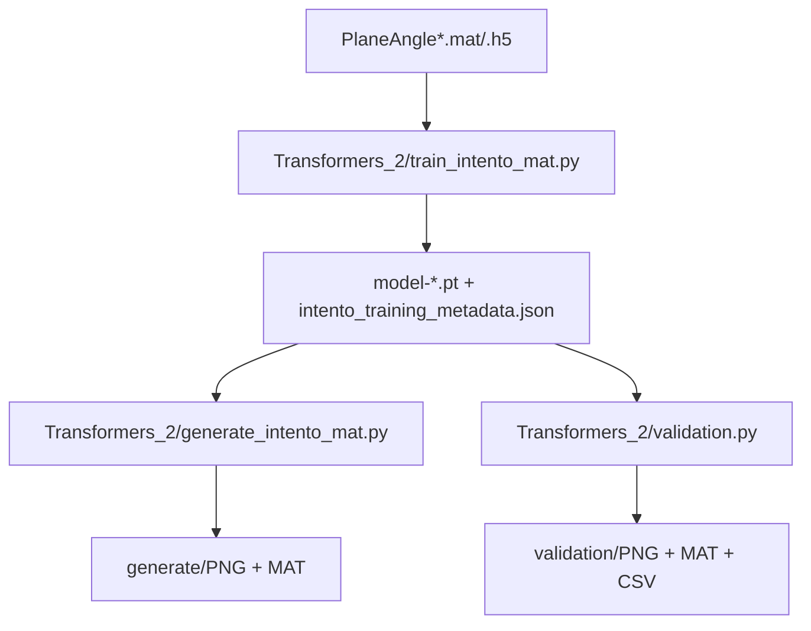
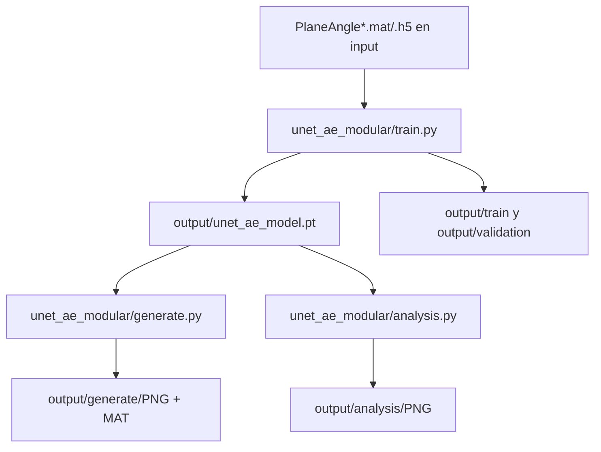

# TFG_repo: generacion condicionada de planos TL


Repositorio con tres subproyectos documentados para modelado y post-procesado de campos de Transmission Loss (TL) condicionados por angulo.

## Resumen rapido

| Ruta | Tipo de modelo | Estado | Uso recomendado |
|---|---|---|---|
| Transformers_2 | DiT + Diffusion (MAT/H5) | Activa y documentada | Maxima calidad y control generativo |
| unet_ae_modular | UNet Autoencoder condicional | Activa | Iteracion rapida y menor coste |
| Manipulacion_de_Planos | Postproceso MAT -> VTS (PyVista/ParaView) | Activa | Exportacion 3D para visualizacion y QA |

## Sub-README por carpeta

- [Transformers_2/README.md](Transformers_2/README.md): flujo DiT principal (train, generate, validation).
- [unet_ae_modular/README.md](unet_ae_modular/README.md): flujo UNet AE para iteracion rapida.
- [Manipulacion_de_Planos/README.md](Manipulacion_de_Planos/README.md): conversion de MAT a malla 3D `.vts`.

## Estructura global

```text
TFG_repo/
├── README.md
├── Transformers_2/          # Ruta DiT principal (train_intento_mat / generate_intento_mat)
├── unet_ae_modular/         # Ruta UNet AE
└── Manipulacion_de_Planos/  # Rotacion de planos y exportacion VTS para ParaView
```

## Seccion DiT (actualizada)

La ruta DiT recomendada en este repo es Transformers_2.

Archivos clave de la ruta DiT:
- Transformers_2/config.py
- Transformers_2/train_intento_mat.py
- Transformers_2/generate_intento_mat.py
- Transformers_2/validation.py
- Transformers_2/intento_mat_utils.py
- Transformers_2/denoising_diffusion_pytorch/

### Flujo DiT



### Configuracion y ejecucion DiT

1. Ajustar defaults en Transformers_2/config.py.
2. Entrenar:

```bash
cd Transformers_2
python train_intento_mat.py
```

3. Generar:

```bash
cd Transformers_2
python generate_intento_mat.py --results-folder results/intento_mat/dit_gaussian --prefer-ema
```

4. (Opcional) validar standalone:

```bash
cd Transformers_2
python validation.py --results-folder results/intento_mat/dit_gaussian --prefer-ema
```

Notas importantes de la ruta DiT:
- train_intento_mat.py guarda metadata completa del experimento junto al checkpoint.
- generate_intento_mat.py reconstruye el modelo desde esa metadata para mantener compatibilidad.
- Cambiar config.py afecta defaults futuros; no reescribe metadata de experimentos ya entrenados.
- En Transformers_2/No_usar quedan scripts movidos que no participan en este flujo.

## Seccion UNet AE (actualizada)

La ruta UNet recomendada en este repo para iteracion rapida es unet_ae_modular.

Archivos clave de la ruta UNet AE:
- unet_ae_modular/config.py
- unet_ae_modular/model.py
- unet_ae_modular/data_utils.py
- unet_ae_modular/train.py
- unet_ae_modular/generate.py
- unet_ae_modular/analysis.py

### Flujo UNet AE



### Configuracion y ejecucion UNet AE

1. Ajustar defaults en unet_ae_modular/config.py.
2. Entrenar:

```bash
cd unet_ae_modular
python train.py
```

3. Generar:

```bash
cd unet_ae_modular
python generate.py
```

4. (Opcional) analisis latente/crossover:

```bash
cd unet_ae_modular
python analysis.py
```

Notas importantes de la ruta UNet AE:
- config.py centraliza hiperparametros y rutas de entrada/salida.
- train.py guarda checkpoint en output/unet_ae_model.pt y reportes en train/validation.
- generate.py reutiliza ese checkpoint para generar MAT y PNG de forma directa.
- Si existe input/validation, train.py ejecuta validacion al finalizar.
- Es un flujo determinista y de menor coste que DiT para pruebas rapidas.

## Seccion Manipulacion de Planos (resumen)

La ruta Manipulacion_de_Planos se usa como postproceso para convertir planos .mat a una geometria 3D rotada por angulo y exportar .vts para ParaView.

Archivos clave:
- Manipulacion_de_Planos/Representacion_planos_pyvista.py
- Manipulacion_de_Planos/README.md

### Flujo Manipulacion


### Ejecucion Manipulacion

1. Revisar en el script: folder, PLANE_GRID_SHAPE, EXPORT_VTS y VTS_OUTPUT_PATH.
2. Ejecutar:

```bash
cd Manipulacion_de_Planos
python Representacion_planos_pyvista.py
```

Notas rapidas:
- PLANE_GRID_SHAPE debe coincidir con las dimensiones reales de cada .mat.
- Si un plano llega transpuesto, el script lo corrige automaticamente cuando detecta (ny, nx).

## Recomendacion practica

- Si priorizas calidad final y control generativo: usa Transformers_2 (DiT).
- Si priorizas velocidad de iteracion y coste bajo: usa unet_ae_modular.
- Si necesitas visualizacion 3D o entrega en ParaView: usa Manipulacion_de_Planos tras generar MAT.
