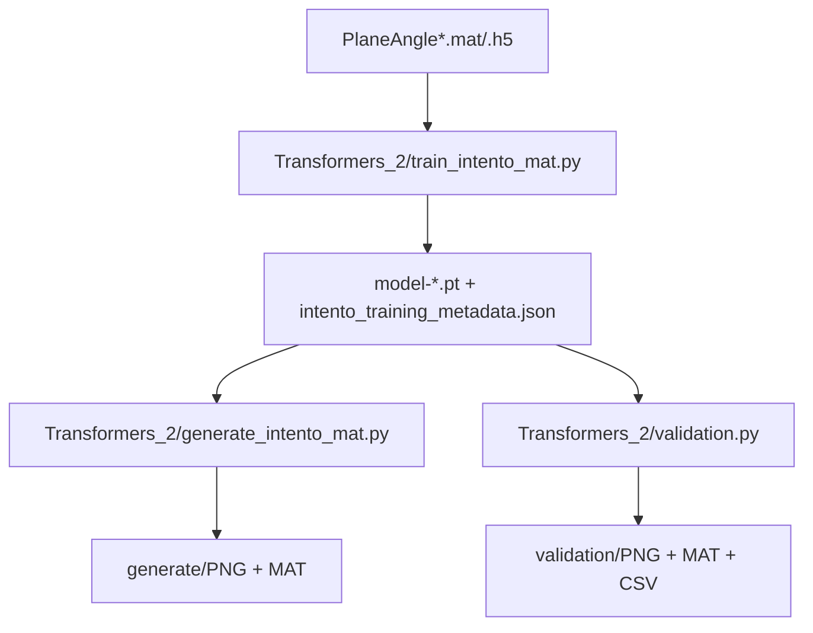

# TFG_repo: generacion condicionada de planos TL

Repositorio con dos rutas principales de modelado para campos de Transmission Loss (TL) condicionados por angulo.

## Resumen rapido

| Ruta | Tipo de modelo | Estado | Uso recomendado |
|---|---|---|---|
| Transformers_2 | DiT + Diffusion (MAT/H5) | Activa y documentada | Maxima calidad y control generativo |
| unet_ae_modular | UNet Autoencoder condicional | Activa | Iteracion rapida y menor coste |
| Intento_Transformers | Implementacion previa/alternativa | Conservada | Referencia historica y comparativas |

## Estructura global

```text
TFG_repo/
├── README.md
├── Transformers_2/          # Ruta DiT principal (train_intento_mat / generate_intento_mat)
├── unet_ae_modular/         # Ruta UNet AE
└── Intento_Transformers/    # Codigo previo/alternativo
```

## Seccion DiT (actualizada)

La ruta DiT recomendada en este repo es Transformers_2.

Archivos clave de la ruta DiT:
- Transformers_2/config.py
- Transformers_2/train_intento_mat.py
- Transformers_2/generate_intento_mat.py
- Transformers_2/validation.py
- Transformers_2/intento_mat_utils.py
- Transformers_2/denoising_diffusion_pytorch/

### Flujo DiT



### Configuracion y ejecucion DiT

1. Ajustar defaults en Transformers_2/config.py.
2. Entrenar:

```bash
cd Transformers_2
python train_intento_mat.py
```

3. Generar:

```bash
cd Transformers_2
python generate_intento_mat.py --results-folder results/intento_mat/dit_gaussian --prefer-ema
```

4. (Opcional) validar standalone:

```bash
cd Transformers_2
python validation.py --results-folder results/intento_mat/dit_gaussian --prefer-ema
```

Notas importantes de la ruta DiT:
- train_intento_mat.py guarda metadata completa del experimento junto al checkpoint.
- generate_intento_mat.py reconstruye el modelo desde esa metadata para mantener compatibilidad.
- Cambiar config.py afecta defaults futuros; no reescribe metadata de experimentos ya entrenados.
- En Transformers_2/No_usar quedan scripts movidos que no participan en este flujo.

## Ruta UNet AE

La carpeta unet_ae_modular mantiene una alternativa mas rapida para entrenamiento y generacion determinista.
Consulta su README especifico para parametros y flujo.

## Recomendacion practica

- Si priorizas calidad final y tienes presupuesto de GPU: usa Transformers_2 (DiT).
- Si priorizas velocidad de iteracion: usa unet_ae_modular.
