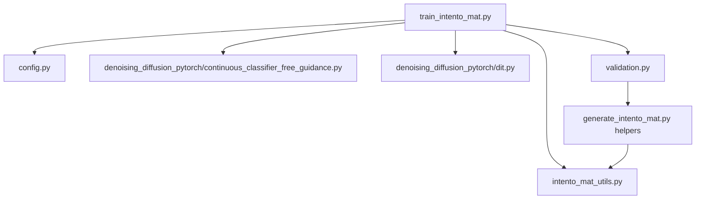
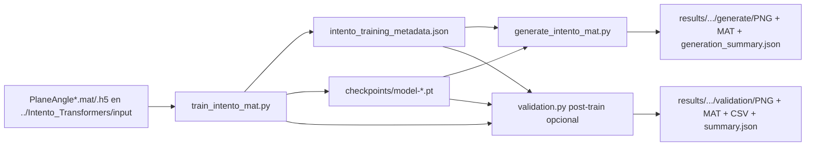

# Transformers_2: flujo MAT/H5 para DiT

Este directorio contiene el flujo activo para entrenar y generar planos TL condicionados por angulo usando los scripts:
- train_intento_mat.py
- generate_intento_mat.py
- validation.py

El objetivo es trabajar con archivos PlaneAngle*.mat/.h5 y producir salidas en PNG y MAT con coordenadas fisicas.

## Estructura activa

```text
Transformers_2/
├── config.py                       # Defaults centralizados (train + generate)
├── train_intento_mat.py            # Entrenamiento principal
├── generate_intento_mat.py         # Generacion condicionada desde checkpoints
├── validation.py                   # Validacion real vs generado
├── intento_mat_utils.py            # Carga MAT/H5, ROI, normalizacion, guardado
├── denoising_diffusion_pytorch/    # Implementacion de DiT/UNet/diffusion
├── results/                        # Salidas de entrenamiento y generacion
├── logs/                           # Logs de ejecucion
├── No_usar/                        # Scripts movidos (no usados en este flujo)
├── train_transformer.sh            # Wrapper opcional (no requerido)
├── gen_transformer.sh              # Wrapper opcional (no requerido)
└── val_transformer.sh              # Wrapper opcional (no requerido)
```

## Dependencias de train_intento_mat.py

Dependencias directas del script de entrenamiento:
- config.py: defaults de argumentos (train + runtime).
- intento_mat_utils.py: IO MAT/H5, ROI, normalizacion, resize, parsing de angulos.
- denoising_diffusion_pytorch/continuous_classifier_free_guidance.py: Unet, GaussianDiffusion, Trainer.
- denoising_diffusion_pytorch/dit.py: catalogo de variantes DiT.
- validation.py: reporte post-train (opcional).



## Flujo real



## Flujo interno completo de train_intento_mat.py

1. Parsea argumentos CLI y aplica defaults desde config.py.
2. Si se pasa --config JSON, mezcla claves validas respetando prioridad de CLI.
3. Aplica quality profile si corresponde.
4. Ajusta de forma preventiva la variante DiT para mantener tokens seguros en atencion vanilla.
5. Resuelve carpeta de resultados.
6. Carga datos de entrenamiento desde MAT/H5 y extrae ROIs.
7. Carga validacion si hay carpeta disponible.
8. Calcula estadisticas de normalizacion (TL y angulo) usando train.
9. Normaliza campos y condicion, redimensiona a train_height x train_width, y garantiza minimo de muestras.
10. Construye modelo (UNet o DiT) y envoltura de difusion (Gaussian o FlowMatching).
11. Inicializa Trainer con salida organizada en subcarpetas.
12. Si resume_if_compatible esta activo, reanuda desde el ultimo checkpoint compatible (checkpoints/ o layout legacy).
13. Guarda metadata del experimento y copia scripts usados.
14. Ejecuta entrenamiento.
15. Si no se desactiva, lanza validacion post-train usando el ultimo checkpoint descubierto.

Detalle del paso 5 (carpeta de resultados):
- modo by_config: results/.../cfg_<firma>
- modo legacy: results/... directo

Detalle del paso 11 (subcarpetas):
- checkpoints/ para model-*.pt
- colored_grids/ para colored_grid*.png

## Como se aplican los parametros

Los defaults de train y generate salen de config.py.

Orden de prioridad en entrenamiento:
1. Argumentos CLI (por ejemplo --train-num-steps 200000)
2. JSON pasado con --config (si existe)
3. Defaults de config.py

Orden de prioridad en generacion:
1. Argumentos CLI
2. Defaults de config.py

Importante:
- El script de generacion reconstruye arquitectura y difusion desde intento_training_metadata.json del experimento.
- Cambiar config.py no modifica checkpoints antiguos; afecta a nuevas ejecuciones o a parametros de runtime no persistidos en metadata.
- En layout by_config, cada firma de configuracion usa su propia carpeta cfg_<hash> para evitar mezclar checkpoints incompatibles.

## Entrenamiento

Ejemplo minimo:

```bash
python train_intento_mat.py
```

Ejemplo recomendado para mejor calidad (si hay VRAM disponible):

```bash
python train_intento_mat.py \
  --quality-profile 8h-balanced \
  --amp \
  --mixed-precision-type bf16
```

Ejemplo con config JSON (ademas de config.py):

```bash
python train_intento_mat.py --config train_config_high_quality.json
```

Comportamiento clave del train:
- Carga datos desde input_folder y validation_folder (por defecto en ../Intento_Transformers/input).
- Extrae ROI con intento_mat_utils.py.
- Normaliza TL y angulo.
- Garantiza minimo de muestras para Trainer (si hace falta, replica con ruido leve).
- Entrena con DiT o UNet y GaussianDiffusion o FlowMatching.
- Guarda metadata completa + checkpoints.
- Ejecuta validacion post-entrenamiento salvo que se use --skip-post-validation.

## Generacion

Ejemplo minimo:

```bash
python generate_intento_mat.py --results-folder results/intento_mat/dit_gaussian
```

Ejemplo recomendado:

```bash
python generate_intento_mat.py \
  --results-folder results/intento_mat/dit_gaussian \
  --prefer-ema \
  --sampler ddim \
  --num-inference-steps 400 \
  --cond-scale 3.0
```

Comportamiento clave de generate:
- Lee metadata y checkpoint (explicito, por milestone, o el ultimo disponible).
- Reconstruye modelo y difusion compatibles con ese entrenamiento.
- Genera para lista de angulos.
- Exporta PNG y MAT.
- Si se usa --with-reference, anade comparacion con muestra real mas cercana y error.

## Validacion standalone

```bash
python validation.py \
  --results-folder results/intento_mat/dit_gaussian \
  --prefer-ema \
  --sampler ddim \
  --num-inference-steps 300
```

## Salidas esperadas por experimento

```text
results/intento_mat/<run>/
├── checkpoints/
│   └── model-*.pt
├── colored_grids/
│   └── colored_grid*.png
├── intento_training_metadata.json
├── train_intento_mat.py              # copia del script usado
├── intento_mat_utils.py              # copia del utils usado
├── loss_evolution.png
├── generate/
│   ├── PNG/
│   ├── MAT/
│   └── generation_summary.json
└── validation/
    ├── PNG/
    ├── MAT/
    ├── validation_metrics.csv
    └── validation_summary.json
```

## Notas tecnicas utiles

- Para DiT con atencion vanilla, train_intento_mat.py puede auto-ajustar el patch de la variante para no exceder max_vanilla_attn_tokens.
- Si quieres fijar manualmente el patch, define dit_variant y max_vanilla_attn_tokens en config.py.
- Si quality_profile esta en 8h-balanced o 8h-highres, el script aplica un preset orientado a calidad respetando overrides explicitos.
- Los .sh se pueden seguir usando como wrappers, pero no son necesarios para el flujo Python directo.
- generate_intento_mat.py y validation.py aceptan checkpoints en checkpoints/ y mantienen compatibilidad con layouts antiguos en raiz.
